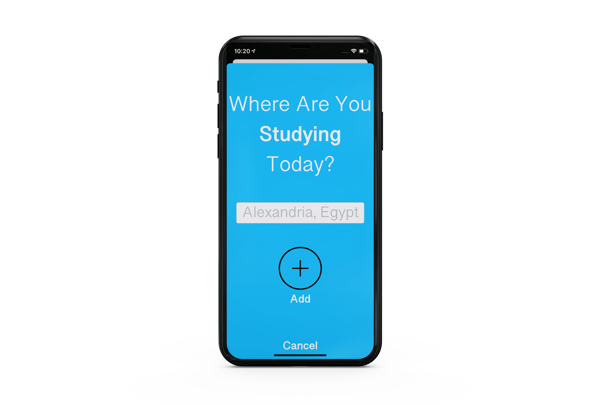

# On-The-Map
 (Udacity iOS Developer Nanodegree.)
- On the Map utilizes Apple MapKit and Udacity API to show a map that shows information posted by other students.
 The map will contain pins that show the location where other students have reported studying. 
 By tapping on the pin users can see a URL posted by their fellow students. 
 The user will be able to add their own data by their location string, then their link.

## This project focused on
* Accessing networked data using Apple’s URL loading framework.
* Authenticating a user over a network connection and making network request (Get , Post , Put , Delete).
* Parsing JSON file using Codable (Decodable , Encodable).
* Creating user interfaces that are responsive, asynchronous requests.
* Use Core Location and the MapKit framework to display annotated pins on a map.

## App Structure
- On The Map is following the MVC pattern.

  

## Login Screen 
- Allows the user to log in using their Udacity credentials, the user's credentials are wrapped into a "POST" request and authenticated using Udacity API, after that, a "GET" request is sent to fetch the students' data from the API.
- If the login does not succeed, the user will be presented with an alert view specifying whether it was a failed network connection, or an incorrect email and password.

  
  

## Sign up Screen
- By tapping, Sign up users is directed to Udacity website to create their account.

  

## Map Screen
- Displays a map with pins specifying the last 100 locations posted by students.
- Tapping on the pin launches Safari and direct it to the link associated with the cell.
- The App asks for your permission to access your location.

  
  

## Table Screen
- The data can either be displayed in a map view or in a table view.
- Tapping on the row launches Safari and direct it to the link associated with the cell.

  

## Add Pin Screen
- Students has the ability to add and modify their information through "POST"/"PUT" requests.

- By clicking on the pin button, the user can add a pin by adding their location string.

  

- If location isn't found an alert view specifying the problem.

  

- Then, the user is asked to add their link.

  

- Users can only add one pin and modify it whenever they want.

  

## Dependencies:
* Apple UIKit
* Apple MapKit
* Udacity API
